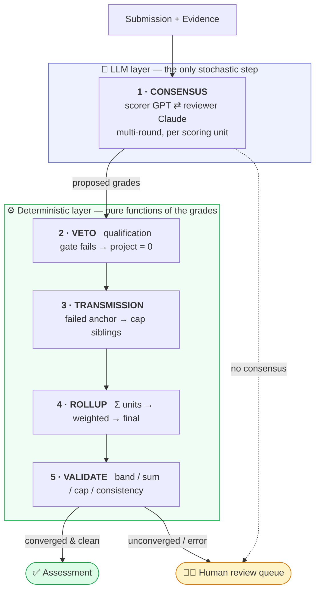

<div align="center">

# ⚖️ Tribunal

### Multi-agent LLM document assessment with deterministic arbitration

*Two language models — a **scorer** and an independent **reviewer** — grade a document against a machine-readable rubric over multiple rounds. A deterministic layer they cannot influence does every calculation, enforces the qualification gates, and escalates anything they can't agree on to a human.*

<br>

[](https://github.com/awsl5714/tribunal/actions/workflows/ci.yml)
[](https://www.python.org)
[](tests)
[](https://github.com/astral-sh/ruff)
[](http://mypy-lang.org)
[](LICENSE)

<br>

**GPT scores it. Claude audits it. Code arbitrates it. A human decides the hard 15%.**

</div>

---

## The problem

Handing a rubric-graded document to a single LLM and asking for a score fails in three predictable ways:

<table>
<tr>
<th align="left">❌ Failure mode</th>
<th align="left">🛡️ Tribunal's answer</th>
</tr>
<tr>
<td><b>It does the arithmetic wrong.</b><br><sub>Sums that don't add up, scores outside their grade band, weighted totals that don't reconcile.</sub></td>
<td><b>The model judges, the code computes.</b><br><sub>LLMs only ever emit a <i>grade</i>; a deterministic engine turns grades into numbers, sums, weights, and validates every result.</sub></td>
</tr>
<tr>
<td><b>It rationalises.</b><br><sub>One model, one pass — nothing challenges an over-generous or under-evidenced score.</sub></td>
<td><b>Dual-LLM consensus.</b><br><sub>GPT proposes, Claude independently audits, they iterate over rounds; the conservative score wins ties.</sub></td>
</tr>
<tr>
<td><b>It fabricates confidence.</b><br><sub>It returns a clean number for cases a human should actually decide.</sub></td>
<td><b>Human-in-the-loop.</b><br><sub>Non-convergence, ambiguous gates, and surviving validator errors are escalated — never guessed.</sub></td>
</tr>
</table>

> Distilled from a real project: reviewing ~100 graduation portfolios (hundreds of pages of PDF/Word + Excel scoresheets each) against a rubric with ~30 line items, weighted projects, qualification gates and bonus caps. The deterministic layer caught **~85%** of grade-band errors automatically and concentrated the genuinely hard cases into the **~15%** that reached a human.
>
> This repo ships **synthetic examples only** — no real data. The rubric is a generalised, anonymised version of the original.

---

## How it works



The two models touch **only step 1**. Everything after is a pure function of their grades — reproducible, testable, auditable. Full write-up in [`docs/architecture.md`](docs/architecture.md).

---

## Quickstart

```bash
git clone https://github.com/awsl5714/tribunal && cd tribunal
pip install -e ".[dev]"     # core + test tooling — no API keys needed

python examples/demo.py     # runs fully offline on a deterministic mock backend
pytest -q                   # 44 tests
```

<details>
<summary><b>▶︎ Offline demo output</b> — a clean pass vs. a double-veto</summary>

```text
Synthetic Candidate A (SYN-001)
  research            total= 76.7   weighted= 23.01
  team                total= 63.1   weighted= 18.93
  digital_resources   total= 77.5   weighted=  7.75
  development_report  total= 72.4   weighted=  7.24
  elective_exam       total= 79.4   weighted= 15.88
  base=72.81  bonus=8.0  FINAL=80.81      human review needed: False

Synthetic Candidate B (SYN-002)
  research            total=  0.0   weighted=  0.0    VETOED  (not project owner)
  elective_exam       total=  0.0   weighted=  0.0    VETOED  (corresponding author, not first author)
  base=33.92  bonus=0   FINAL=33.92       human review needed: True
```

Candidate B fails two independent qualification gates; both projects zero out and the case is held for a human — no invented number.
</details>

### With the real GPT + Claude backends

```bash
pip install -e ".[llm]"
export OPENAI_API_KEY=…  ANTHROPIC_API_KEY=…

python -m tribunal.cli score \
    --rubric examples/rubric.yaml \
    --submission examples/submission_pass.json \
    --backend openai+anthropic
```

`OpenAIClient` is the scorer, `AnthropicClient` the reviewer — swap either for any class implementing the three-method [`LLMClient`](src/tribunal/agents/llm_client.py) interface.

---

## Library usage

```python
from tribunal import (
    load_rubric, Submission, Evidence,
    Scorer, Reviewer, ConsensusOrchestrator,
    OpenAIClient, AnthropicClient,
    ReviewPipeline, GateEvaluator, EscalationQueue,
)

rubric = load_rubric("examples/rubric.yaml")

orchestrator = ConsensusOrchestrator(
    Scorer(OpenAIClient("gpt-4o")),                    # proposes
    Reviewer(AnthropicClient("claude-sonnet-4-5")),    # independently audits
)
pipeline = ReviewPipeline(rubric, orchestrator)

assessment = pipeline.run(submission, gates, queue := EscalationQueue())

print(assessment.final_total, assessment.needs_human_review)
for ticket in queue.tickets:
    print(ticket.summary())
```

---

## What's inside

| Design choice | Why it matters |
|---|---|
| 🧮 **One grade-band engine** | [`grade_bands.py`](src/tribunal/rubric/grade_bands.py) generates *every* band table (max 5 → 60) from a single ratio table, and is the **sole authority** mapping grade ↔ number. Ten hand-written tables collapse into ~15 lines. |
| 🚦 **Two one-vote vetoes, generalised** | A research-qualification gate and an authorship-role gate each zero an entire project when the candidate doesn't qualify — declarative [`VetoRule`s](src/tribunal/domain/rubric.py), applied deterministically. |
| 📉 **Transmission over hard-capping** | When a project's anchor fails, sibling units are capped so the total *naturally* lands below the pass mark — preserving "total = Σ units" instead of clamping after the fact. |
| 🧑‍⚖️ **Escalation, not averaging** | Two assessors who genuinely disagree are never silently averaged — the unit is flagged `ESCALATED` and the result held. |
| 📝 **Rubric as data** | Units, weights, bands, gates and caps live in [`examples/rubric.yaml`](examples/rubric.yaml); a domain expert changes scoring policy without touching Python. A validating loader rejects malformed rubrics. |

---

## Project layout

```text
src/tribunal/
├── domain/         rubric, submission, assessment data model
├── rubric/         YAML loader + deterministic grade-band engine
├── agents/         LLM clients (mock / OpenAI / Anthropic), scorer, reviewer, orchestrator
├── validation/     veto & transmission rules + the post-check suite
├── hitl/           human-in-the-loop escalation queue
├── pipeline/       document extractors + end-to-end runner
└── cli.py
tests/              44 tests — grade bands · vetoes · transmission · consensus · validator · pipeline
examples/           runnable demo · YAML rubric · synthetic submissions
docs/               architecture · rubric schema · design decisions
```

<div align="center">

**[Architecture](docs/architecture.md)** · **[Rubric schema](docs/rubric-schema.md)** · **[Design decisions](docs/design-decisions.md)**

<sub>MIT licensed · built with GPT + Claude in the loop</sub>

</div>
