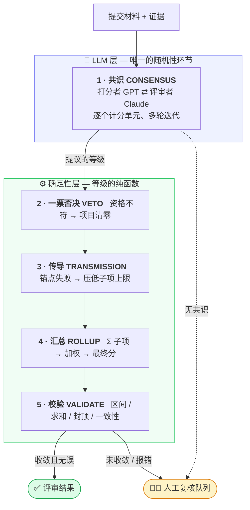

<div align="center">

# ⚖️ Tribunal

### 基于多智能体 LLM 的文档评审系统 · 确定性仲裁

*两个大语言模型——一个**打分者**、一个独立的**评审者**——按机器可读的评分细则对文档进行多轮评分。一个它们无法干预的确定性层负责所有计算、执行资格一票否决，并把双方无法达成一致的情形升级给人工。*

<br>

[](https://github.com/awsl5714/tribunal/actions/workflows/ci.yml)
[](https://www.python.org)
[](tests)
[](https://github.com/astral-sh/ruff)
[](http://mypy-lang.org)
[](LICENSE)

<br>

**GPT 打分，Claude 复核，代码仲裁，人工决定最难的 15%。**

<br>

**简体中文** · [English](README.en.md)

</div>

---

## 要解决的问题

把一份需要按细则打分的文档直接丢给单个 LLM 让它给分，会出现三类可预见的失败：

<table>
<tr>
<th align="left">❌ 失败模式</th>
<th align="left">🛡️ Tribunal 的对策</th>
</tr>
<tr>
<td><b>算术会算错。</b><br><sub>子项加不出总分、分数落在错误的等级区间、加权总分对不上。</sub></td>
<td><b>模型只判断，代码来计算。</b><br><sub>LLM 只输出一个<i>等级</i>；由确定性引擎把等级换算成分数、求和、加权，并校验每一个结果。</sub></td>
</tr>
<tr>
<td><b>会自我合理化。</b><br><sub>一个模型、一遍过——没有任何机制去质疑一个过于宽松或证据不足的分数。</sub></td>
<td><b>双 LLM 共识。</b><br><sub>GPT 提议，Claude 独立复核，多轮迭代；分歧接近时取更保守的分数。</sub></td>
</tr>
<tr>
<td><b>会伪造确定性。</b><br><sub>对本应由人来裁定的情形，也照样给出一个干净利落的分数。</sub></td>
<td><b>人在环路中（HITL）。</b><br><sub>无法收敛、资格判定模糊、校验仍报错的情形一律升级人工——绝不猜。</sub></td>
</tr>
</table>

> 源自一个真实项目：按一套约 30 个计分单元、含加权项目、资格一票否决与加分封顶的评分细则，评审约 100 名学员的结业材料（每人数百页 PDF/Word + Excel 评分表）。确定性层自动拦截了约 **85%** 的等级区间错误，把真正的疑难案例收敛到需人工处理的约 **15%**。
>
> 本仓库**仅包含合成示例数据**，无任何真实数据。示例评分细则是原始细则的泛化、匿名版本。

---

## 工作原理



两个模型**只参与第 1 步**。之后的一切都是它们所给等级的纯函数——可复现、可测试、可审计。完整说明见 [`docs/architecture.md`](docs/architecture.md)。

---

## 快速开始

```bash
git clone https://github.com/awsl5714/tribunal && cd tribunal
pip install -e ".[dev]"     # 核心 + 测试工具，无需任何 API key

python examples/demo.py     # 完全离线，使用确定性 mock 后端运行
pytest -q                   # 44 个测试
```

<details>
<summary><b>▶︎ 离线演示输出</b> —— 一个正常通过 vs. 一个双重否决</summary>

```text
Synthetic Candidate A (SYN-001)
  research            total= 76.7   weighted= 23.01
  team                total= 63.1   weighted= 18.93
  digital_resources   total= 77.5   weighted=  7.75
  development_report  total= 72.4   weighted=  7.24
  elective_exam       total= 79.4   weighted= 15.88
  base=72.81  bonus=8.0  FINAL=80.81      human review needed: False

Synthetic Candidate B (SYN-002)
  research            total=  0.0   weighted=  0.0    VETOED  (非项目负责人)
  elective_exam       total=  0.0   weighted=  0.0    VETOED  (通讯作者，非第一作者)
  base=33.92  bonus=0   FINAL=33.92       human review needed: True
```

候选人 B 触发了两个独立的资格一票否决，两个项目均清零，案例被保留给人工——不编造任何分数。
</details>

### 使用真实的 GPT + Claude 后端

```bash
pip install -e ".[llm]"
export OPENAI_API_KEY=…  ANTHROPIC_API_KEY=…

python -m tribunal.cli score \
    --rubric examples/rubric.yaml \
    --submission examples/submission_pass.json \
    --backend openai+anthropic
```

`OpenAIClient` 作打分者，`AnthropicClient` 作评审者——任一方都可替换为实现了三方法 [`LLMClient`](src/tribunal/agents/llm_client.py) 接口的类。

---

## 库调用示例

```python
from tribunal import (
    load_rubric, Submission, Evidence,
    Scorer, Reviewer, ConsensusOrchestrator,
    OpenAIClient, AnthropicClient,
    ReviewPipeline, GateEvaluator, EscalationQueue,
)

rubric = load_rubric("examples/rubric.yaml")

orchestrator = ConsensusOrchestrator(
    Scorer(OpenAIClient("gpt-4o")),                    # 提议
    Reviewer(AnthropicClient("claude-sonnet-4-5")),    # 独立复核
)
pipeline = ReviewPipeline(rubric, orchestrator)

assessment = pipeline.run(submission, gates, queue := EscalationQueue())

print(assessment.final_total, assessment.needs_human_review)
for ticket in queue.tickets:
    print(ticket.summary())
```

---

## 核心设计

| 设计选择 | 意义 |
|---|---|
| 🧮 **单一等级区间引擎** | [`grade_bands.py`](src/tribunal/rubric/grade_bands.py) 用一张比例表就能生成*所有*区间表（满分 5 → 60），是等级 ↔ 分数唯一的换算权威。原本十张手写表压缩成约 15 行。 |
| 🚦 **两类一票否决，已泛化** | 课题资格与成果角色两道资格闸门，任一不符即将整个项目清零——用声明式的 [`VetoRule`](src/tribunal/domain/rubric.py) 表达，确定性执行。 |
| 📉 **传导优于硬封顶** | 项目锚点失败时，压低同项目其余子项的上限，使总分**自然**落到及格线以下——保持"总分 = Σ 子项"，而非事后一刀切。 |
| 🧑‍⚖️ **升级人工，而非取平均** | 真正分歧的两位评审绝不被悄悄取平均——该计分单元标记为 `ESCALATED`，结果保留待人工。 |
| 📝 **评分细则即数据** | 计分单元、权重、区间、闸门、封顶都写在 [`examples/rubric.yaml`](examples/rubric.yaml)；领域专家改评分策略无需动 Python，加载器会校验并拒绝非法细则。 |

---

## 项目结构

```text
src/tribunal/
├── domain/         领域模型：评分细则、提交材料、评审结果
├── rubric/         YAML 加载器 + 确定性等级区间引擎
├── agents/         LLM 客户端（mock / OpenAI / Anthropic）、打分者、评审者、编排器
├── validation/     一票否决与传导规则 + 后置校验套件
├── hitl/           人工复核升级队列
├── pipeline/       文档抽取器 + 端到端流水线
└── cli.py
tests/              44 个测试 —— 等级区间 · 一票否决 · 传导 · 共识 · 校验 · 流水线
examples/           可运行 demo · YAML 评分细则 · 合成提交样例
docs/               架构 · 细则 schema · 设计决策
```

<div align="center">

**[架构](docs/architecture.md)** · **[评分细则 schema](docs/rubric-schema.md)** · **[设计决策](docs/design-decisions.md)**

<sub>MIT 许可 · 构建过程中 GPT 与 Claude 全程参与</sub>

</div>
